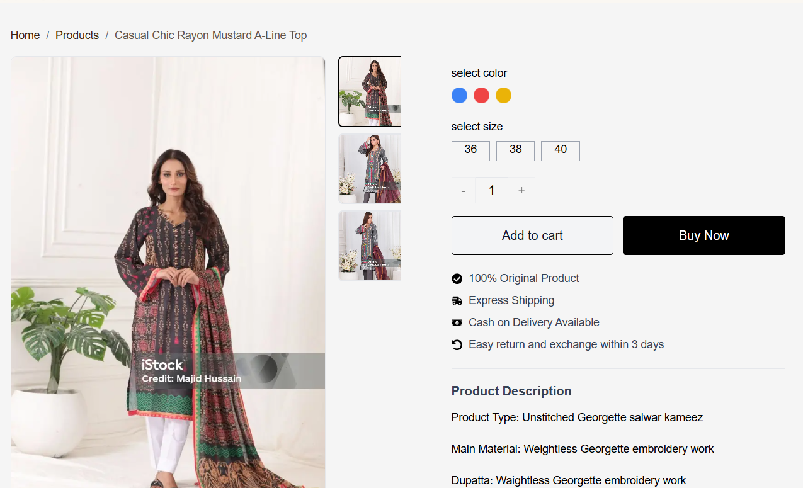
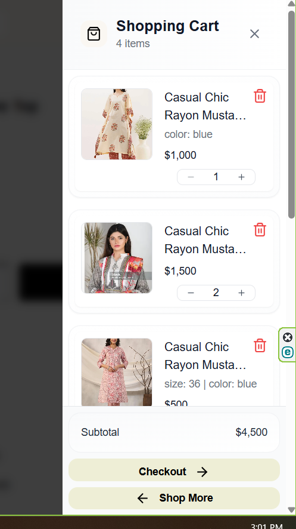
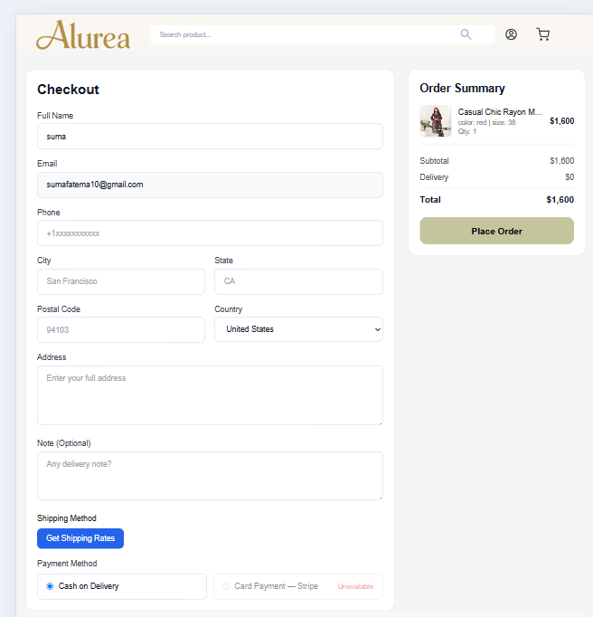
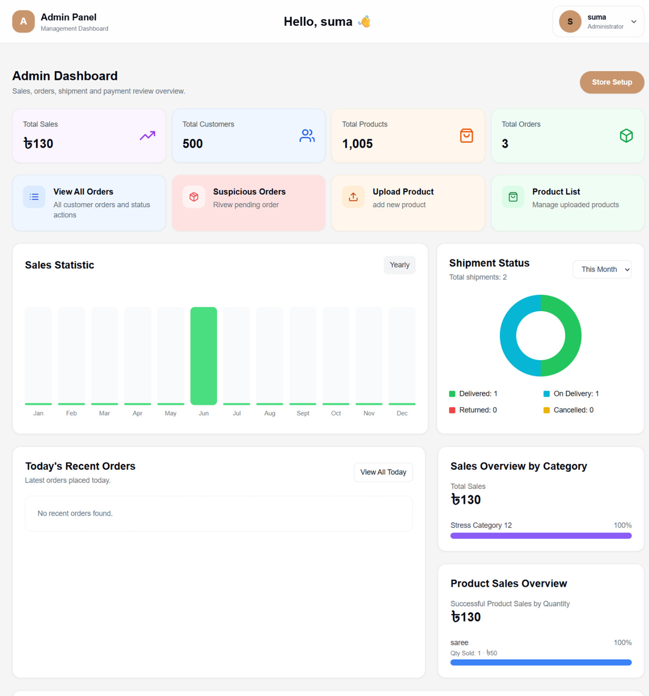

<p align="center">
  
</p>

# 🛍️ E-Commerce Frontend


Modern, responsive and production-ready **Next.js 15** frontend for a complete eCommerce platform featuring authentication, shopping cart, checkout, Stripe test payment, shipping integration, and an admin dashboard.


---

# 🌐 Live Demo

**Website:** https://www.sumashop.xyz

**Backend API:** https://api.sumashop.xyz

---

# 🚀 Tech Stack

- Next.js 15
- React 19
- TypeScript
- Tailwind CSS
- Redux Toolkit
- Axios
- React Hook Form
- Zod Validation
- Cloudinary
- Stripe (Test Mode)
- Shippo API
- Vercel

---

# ✨ Core Features

- Secure User Authentication
- Role-Based Access Control (RBAC)
- Product Search
- Product Categories
- Product Variants
- Shopping Cart
- Secure Checkout
- Cash on Delivery (COD)
- Stripe Test Mode
- Shipping Integration
- Order Tracking
- Responsive Design
- Admin Dashboard
- Flash Deals
- Image Gallery

---

# 🧠 Business Logic

This frontend communicates with a production-ready NestJS backend and provides real-world shopping workflows including:

- Product browsing
- Product filtering
- Secure authentication
- Shopping cart management
- Checkout workflow
- Stripe Test Payment
- Cash on Delivery
- Shipping integration
- Order tracking
- Responsive mobile experience

---

# 📸 Screenshots

> Add screenshots inside `/docs/screenshots`

### Home Page


### Product Details



### Shopping Cart



### Checkout




### Admin Dashboard



### Mobile View


---

# 🏗️ System Architecture


```text               User Browser
                           │
                           ▼
                    Next.js Frontend
                           │
                           ▼
                  REST API (HTTPS)
                           │
                           ▼
                 NestJS Backend API
                           │
      ┌────────────┬──────────────┬─────────────┐
      ▼            ▼              ▼             ▼
 PostgreSQL   Cloudinary     Shippo API   Stripe (Test Mode)
(Database)   (Image Store)    (Shipping)     (Payments)
```


---

# 📂 Project Structure

```text
src
│
├── app
├── components
├── hooks
├── lib
├── services
├── store
├── types
├── utils
├── providers
└── middleware
```

> Update the folder names if your project structure differs.

---

# ⚙️ Installation

```bash
git clone https://github.com/Fatema-Akther/ecommerce-platform-Frontend

cd ecommerce-platform-Frontend

npm install

npm run dev
```

---

# 🔑 Environment Variables

Create a `.env.local` file.

```env
NEXT_PUBLIC_API_URL=

NEXT_PUBLIC_STRIPE_PUBLISHABLE_KEY=

NEXT_PUBLIC_CLOUDINARY_CLOUD_NAME=
```

> Never commit your real API keys or secrets.

---

# 📈 Future Improvements

- Wishlist
- Coupon System
- Product Reviews
- Multi-language Support
- Push Notifications
- PWA Support
- Performance Optimization
- Dark Mode Customization

---

# 👩‍💻 Author

**Fatema Akther**

Frontend Developer

🌐 Live Website: https://www.sumashop.xyz

Backend API: https://api.sumashop.xyz

---

# 📄 License

© 2026 Fatema Akther. All rights reserved.